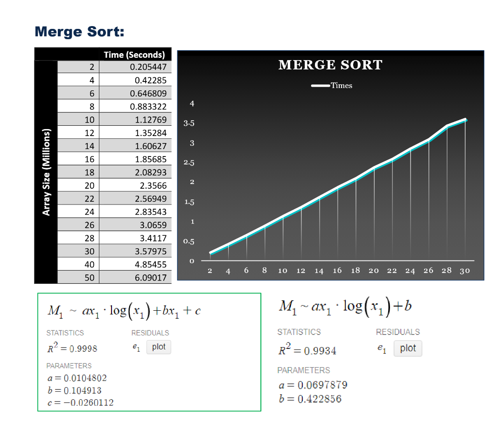

# Sort Analysis Report

This expiremental report aimed at testing various Comparison & Non-Comparison sorting algorithms in order to draw conclusions about each one:

| Comparison Sorts | Non-Comparison Sorts |
|----------|----------|
| Merge Sort   | Radix Sort   |
| Comb Sort   | Count Sort   |
| Shell Sort   | Bucket Sort   |
| Heap Sort   |    |
| Algorithm's Library Sort   |    |
 
The full testing procedures, results, and conclusions can be found in the [Report PDF](Project01%20Report.pdf) .

## Report Preview

